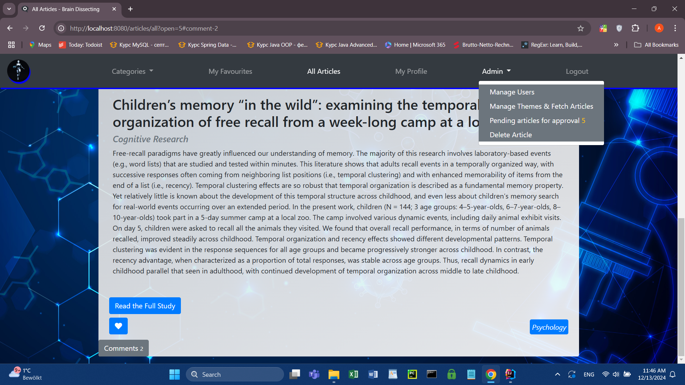

# Hi there 👋

- 🎓 I’m currently studying Software Development at Software University (SoftUni).
- 🔧 -> **Brain Dissecting**  is my first full-stack web application, designed for exploring and moderating scientific content. It's built with Java, Spring Boot, Thymeleaf, and Bootstrap.
- <a href="https://doaj.org/api/v3/docs" target="_blank">DOAJ API</a> Integration: Fetches and displays open-access scientific articles, enabling users to explore diverse research topics directly within the application. Check it out here: ## Watch the Demo Video
  
[BrainDissecting Repository](https://github.com/AntoanYosifov/BrainDissecting-SSR-version)

- 📬 You can reach me on [LinkedIn](https://www.linkedin.com/in/antoan-yosifov-b1b52026b/) or by [email](mailto:tapaktapxaomi@gmail.com).

Feel free to connect with me and check out my repositories!
